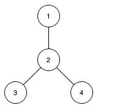

## 题目描述
[leetcode 困难题](https://leetcode.cn/problems/count-subtrees-with-max-distance-between-cities/description/)

给你 n 个城市，编号为从 1 到 n 。同时给你一个大小为 n-1 的数组 edges ，其中 edges[i] = [ui, vi] 表示城市 ui 和 vi 之间有一条双向边。题目保证任意城市之间只有唯一的一条路径。换句话说，所有城市形成了一棵 树 。

一棵 子树 是城市的一个子集，且子集中任意城市之间可以通过子集中的其他城市和边到达。两个子树被认为不一样的条件是至少有一个城市在其中一棵子树中存在，但在另一棵子树中不存在。

对于 d 从 1 到 n-1 ，请你找到城市间 最大距离 恰好为 d 的所有子树数目。

请你返回一个大小为 n-1 的数组，其中第 d 个元素（下标从 1 开始）是城市间 最大距离 恰好等于 d 的子树数目。

请注意，两个城市间距离定义为它们之间需要经过的边的数目。

示例1：


```
输入：n = 4, edges = [[1,2],[2,3],[2,4]]
输出：[3,4,0]
解释：
子树 {1,2}, {2,3} 和 {2,4} 最大距离都是 1 。
子树 {1,2,3}, {1,2,4}, {2,3,4} 和 {1,2,3,4} 最大距离都为 2 。
不存在城市间最大距离为 3 的子树。
```

提示1：
```
2 <= n <= 15
edges.length == n-1
edges[i].length == 2
1 <= ui, vi <= n
题目保证 (ui, vi) 所表示的边互不相同。
```

## 树的直径
城市间的最大距离即[树的直径](https://leetcode.cn/link/?target=https%3A%2F%2Foi-wiki.org%2Fgraph%2Ftree-diameter%2F)，问题转换成求树所有单个连通块的直径。

由于 $n <= 15$ ，我们用 $15$ 位二进制来表示节点的选择情况，通过树形DP或两次 $dfs$来求出某颗子树的直径。

注意题目要求该子集为单个连通块，我们可以在求直径的过程中记录走过的点，$dfs$ 结束时，如果被选择的点都已经访问过，则为合法情况，否则直接丢弃该结果。

### 两次dfs
```Java
class Solution {
    Map<Integer, List<Integer>> g = new HashMap<>();
    Map<Integer, Integer> cnt = new HashMap<>();
    int mask;

    public int[] countSubgraphsForEachDiameter(int n, int[][] edges) {
        for (int[] e : edges) {
            g.computeIfAbsent(e[0] - 1, k -> new ArrayList<>())
                    .add(e[1] - 1);
            g.computeIfAbsent(e[1] - 1, k -> new ArrayList<>())
                    .add(e[0] - 1);
        }
        for (int i = 1; i <= ((1 << n) - 1); i++) {
            if((i & (i - 1)) == 0) continue; // 单个点
            cntD(i);
        }
        return IntStream.range(1, n).map(i -> cnt.getOrDefault(i, 0)).toArray();
    }

    private void cntD(int state){
        int p = Integer.numberOfTrailingZeros(state);
        int[] d = new int[g.size()];
        mask = state;
        dfs(state, p, -1, d);
        if(mask != 0){
            return;
        }
        p = IntStream.range(0, g.size()).boxed().max((a, b) -> d[a] - d[b]).orElseThrow();
        dfs(state, p, -1, d);
        int max = Arrays.stream(d).max().orElseThrow();
        cnt.merge(max, 1, (old, __) -> ++old);
    }

    private void dfs(int state, int p, int fa, int[] d) {
        d[p] = fa == -1 ? 0 : d[fa] + 1;
        mask ^= (1 << p);
        for (int item : g.getOrDefault(p, Collections.emptyList())) {
            if (item == fa || ((1 << item) & state) == 0) {
                continue;
            }
            dfs(state, item, p, d);
        }
    }
}
```

### 树形DP
```Java
class Solution {
    Map<Integer, List<Integer>> g = new HashMap<>();
    Map<Integer, Integer> cnt = new HashMap<>();
    int mask;

    public int[] countSubgraphsForEachDiameter(int n, int[][] edges) {
        for (int[] e : edges) {
            g.computeIfAbsent(e[0] - 1, k -> new ArrayList<>())
                    .add(e[1] - 1);
            g.computeIfAbsent(e[1] - 1, k -> new ArrayList<>())
                    .add(e[0] - 1);
        }
        for (int i = 1; i <= ((1 << n) - 1); i++) {
            cntD(i);
        }
        return IntStream.range(1, n).map(i -> cnt.getOrDefault(i, 0)).toArray();
    }

    private void cntD(int state){
        int p = Integer.numberOfTrailingZeros(state);
        int[] d1 = new int[g.size()];
        int[] d2 = new int[g.size()];
        mask = state;
        dfs(state, p, -1, d1, d2);
        int max = IntStream.range(0, g.size()).map(i -> d1[i] + d2[i]).max().orElseThrow();
        if(mask != 0 || max == 0){
            return;
        }
        cnt.merge(max, 1, (old, __) -> ++old);
    }

    private void dfs(int state, int p, int fa, int[] d1, int[] d2) {
        d1[p] = d2[p] = 0;
        mask ^= (1 << p);
        for (int item : g.getOrDefault(p, Collections.emptyList())) {
            if (item == fa || ((1 << item) & state) == 0) {
                continue;
            }
            dfs(state, item, p, d1, d2);
            int itemMax = d1[item] + 1;
            if(itemMax > d1[p]){
                d2[p] = d1[p];
                d1[p] = itemMax;
            }else if(itemMax > d2[p]){
                d2[p] = itemMax;
            }
        }
    }
}
```