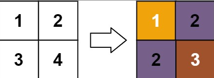
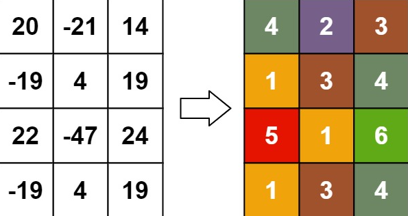

## 题目描述
[leetcode 困难题](https://leetcode.cn/problems/rank-transform-of-a-matrix/)

给你一个 m x n 的矩阵 matrix ，请你返回一个新的矩阵 answer ，其中 answer[row][col] 是 matrix[row][col] 的秩。

每个元素的 秩 是一个整数，表示这个元素相对于其他元素的大小关系，它按照如下规则计算：

秩是从 1 开始的一个整数。
如果两个元素 p 和 q 在 同一行 或者 同一列 ，那么：
如果 p < q ，那么 rank(p) < rank(q)
如果 p == q ，那么 rank(p) == rank(q)
如果 p > q ，那么 rank(p) > rank(q)
秩 需要越 小 越好。
题目保证按照上面规则 answer 数组是唯一的。

示例1：


```
输入：matrix = [[1,2],[3,4]]
输出：[[1,2],[2,3]]
解释：
matrix[0][0] 的秩为 1 ，因为它是所在行和列的最小整数。
matrix[0][1] 的秩为 2 ，因为 matrix[0][1] > matrix[0][0] 且 matrix[0][0] 的秩为 1 。
matrix[1][0] 的秩为 2 ，因为 matrix[1][0] > matrix[0][0] 且 matrix[0][0] 的秩为 1 。
matrix[1][1] 的秩为 3 ，因为 matrix[1][1] > matrix[0][1]， matrix[1][1] > matrix[1][0] 且 matrix[0][1] 和 matrix[1][0] 的秩都为 2 。
```
示例2：


```
输入：matrix = [[20,-21,14],[-19,4,19],[22,-47,24],[-19,4,19]]
输出：[[4,2,3],[1,3,4],[5,1,6],[1,3,4]]
```

提示1：
```
m == matrix.length
n == matrix[i].length
1 <= m, n <= 500
-10^9 <= matrix[row][col] <= 10^9
```

## 两轮枚举
首先由于题意要求 `秩需要越小越好。` ，所以我们可以先按照值大小将元素分组后排序，然后贪心的从小到大遍历这些值进行秩的维护。

设 $colMax[i]、rowMax[i]$ 分别为第 $i$ 行、列当前最大值的下标，当前遍历到的值为 $cur$ ， $cur$ 对应的点下标为 $cur_1,cur_2...cur_n$。

我们先遍历一轮 $cur$ 对应的点的集合，将这些点的秩更新为对应行/列最大秩加一，并更新 $colMax、rowMax$ 。

第一轮遍历结束后，若这些相同值对应的任意两点，均不在同行/同列，那么这些点的秩就正确了。

但如果这些点位于同行/同列时，就可能会产生错误，举例来说：设某个 $cur$ 对应的第一个点下标为 $[1][2]$ ，该行该列当前最大秩为 $4$ ，将其赋给 $[1][2]$ ，此时满足题意，但假如该值对应的下一个点为 $[1][4]$ ，而因为第四列最大秩已经到了 $7$，所以 $[1][4]$ 的秩为 $7$，那么先前 $[1][2]$ 点的秩就与 $[1][4]$ 点发生了冲突，两点位于同一行，值相同，秩却不同，实际上 $[1][2]$点的秩也应该为 $7$ 。

所以我们还要进行第二轮遍历，修正由于该情况带来的错误。容易发现这些点的最终秩，都依赖/等于对应行列的 $cur_i$ 点的最大秩。所以类似拓扑排序，我们可以从没有任何依赖（入边）的点开始处理，即最大的点，接着是该点的行列上的 $cur_i$ ，因为此时这些点的秩也变成了最大秩，也没有了依赖（入边），如此反复，直到这些点的行列上不存在 $cur_i$ ，再接着处理秩为第二大的点，直到所有点遍历结束即可。
```Java
class Solution {
    public int[][] matrixRankTransform(int[][] matrix) {
        int n = matrix.length, m = matrix[0].length;
        // 贪心, 从小到大处理
        Map<Integer, List<int[]>> valueIndexMap = new TreeMap<>();
        for(int i = 0; i < n; i++){
            for(int j = 0; j < m; j++){
                valueIndexMap.computeIfAbsent(matrix[i][j], key -> new ArrayList<>())
                        .add(new int[]{i, j});
            }
        }
        int[] colMax = new int[n];
        int[] rowMax = new int[m];
        int[][] ans = new int[n][m];
        for(List<int[]> indexList : valueIndexMap.values()){
            Consumer<int[]> fun = index -> {
                int curCol = matrix[index[0]][colMax[index[0]]] == matrix[index[0]][index[1]] && ans[index[0]][colMax[index[0]]] != 0 ? ans[index[0]][colMax[index[0]]] : ans[index[0]][colMax[index[0]]] + 1;
                int curRow = matrix[rowMax[index[1]]][index[1]] == matrix[index[0]][index[1]] && ans[rowMax[index[1]]][index[1]] != 0 ? ans[rowMax[index[1]]][index[1]] : ans[rowMax[index[1]]][index[1]] + 1;
                ans[index[0]][index[1]] = Math.max(curCol, curRow);
                colMax[index[0]] = index[1];
                rowMax[index[1]] = index[0];
            };
            // 第一轮, 初始化成当前行列的最大值或最大值加一
            // 此时可能会出现同一行/列的相同值, 它们的秩且不相同的情况
            indexList.forEach(fun);
            Map<Integer, List<int[]>> groupByCol = indexList.stream().collect(Collectors.groupingBy(index -> index[0]));
            Map<Integer, List<int[]>> groupByRow = indexList.stream().collect(Collectors.groupingBy(index -> index[1]));
            int[] visitCol = new int[n];
            int[] visitRow = new int[m];
            // 第二轮, 类似拓扑排序, 从最大的秩的点开始再次处理, 接着是该点同行同列同值的下标, 再接着是较小秩的点
            Queue<int[]> queue = new ArrayDeque<>();
            List<int[]> sortByAns = indexList.stream()
                                        .sorted((a, b) -> ans[b[0]][b[1]] - ans[a[0]][a[1]]).toList();
            int queueCnt = 0;
            while(queueCnt < indexList.size()){
                if(queue.isEmpty()){
                    while(queueCnt < indexList.size() && visitCol[sortByAns.get(queueCnt)[0]] == 1 
                                                    && visitRow[sortByAns.get(queueCnt)[1]] == 1){
                        queueCnt++;
                    }
                    if(queueCnt >= indexList.size()){
                        break;
                    }
                    int[] a = sortByAns.get(queueCnt++);
                    queue.offer(a);
                }
                int[] item = queue.poll();
                if(visitCol[item[0]] != 1){
                    groupByCol.get(item[0]).forEach(index -> {
                        fun.accept(index);
                        if(visitRow[index[1]] == 0){
                            queue.offer(index);
                        }
                    });
                    visitCol[item[0]] = 1;
                }
                if(visitRow[item[1]] != 1){
                    groupByRow.get(item[1]).forEach(index -> {
                        fun.accept(index);
                        if(visitCol[index[0]] == 0){
                            queue.offer(index);
                        }
                    });
                    visitRow[item[1]] = 1;
                }
            }
        }
        return ans;
    }
}
```
## 并查集
上面解法的代码过于复杂，一种逻辑更清晰的解法是使用并查集。

就如上面所说
> 容易发现这些点的最终秩，都依赖/等于对应行列的 $cur_i$ 点的最大秩

于是我们可以直接将这些相同值的同行/同列的点，进行连通，此时就能很容易的维护出一个连通块的秩，为该连通块所有点的秩。

稍微要注意的是，初始化一个并查集的时间复杂度为 $O(n + m)$ ，如果所有点的值均不相同，时间复杂度约为 $O(n \times m \times (n + m))$ ，所以我们可以只初始化一个并查集，而在对于某个值循环结束时，清空对应点的连通即可。
```Java
class Solution {
    public int[][] matrixRankTransform(int[][] matrix) {
        int n = matrix.length, m = matrix[0].length;
        Map<Integer, List<int[]>> valueIndexMap = new TreeMap<>();
        for(int i = 0; i < n; i++){
            for(int j = 0; j < m; j++){
                valueIndexMap.computeIfAbsent(matrix[i][j], key -> new ArrayList<>())
                        .add(new int[]{i, j});
            }
        }
        int[] colMaxRank = new int[n];
        int[] rowMaxRank = new int[m];
        int[][] ans = new int[n][m];
        UnionFind union = new UnionFind(n + m);
        for(List<int[]> indexList : valueIndexMap.values()){
            // 连通
            for(int[] index : indexList){
                union.union(index[0], index[1] + n);
            }
            // 维护秩
            int[] rank = new int[n + m];
            for(int[] index : indexList){
                rank[union.find(index[0])] = Math.max(rank[union.find(index[0])], Math.max(colMaxRank[index[0]], rowMaxRank[index[1]]));
            }
            // 维护 ans
            for(int[] index : indexList){
                ans[index[0]][index[1]] = rank[union.find(index[0])] + 1;
                colMaxRank[index[0]] = ans[index[0]][index[1]];
                rowMaxRank[index[1]] = ans[index[0]][index[1]];
            }
            indexList.forEach(index -> {
                union.clear(index[0]);
                union.clear(index[1] + n);
            });
        }
        return ans;
    }

}

class UnionFind{
    public int[] fa;
    public int[] size;
    private int n;

    public UnionFind(int n){
        this.n = n;
        fa = IntStream.range(0, n).toArray();
        size = IntStream.generate(() -> 1).limit(n).toArray();
    }

    public void union(int a, int b){
        a = find(a);
        b = find(b);
        if(a == b){
            return;
        }
        if(size[a] < size[b]){
            a = a ^ b;
            b = a ^ b;
            a = a ^ b;
        }
        fa[b] = a;
        size[a] += size[b];
    }

    public int find(int a){
        if(a != fa[a]){
            fa[a] = find(fa[a]);
        }
        return fa[a];
    }

    public void clear(int a){
        fa[a] = a;
        size[a] = 1;
    }

}
```