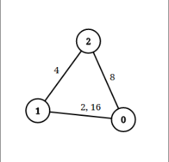

## 题目描述
[leetcode 困难题](https://leetcode.cn/problems/checking-existence-of-edge-length-limited-paths/)

给你一个 n 个点组成的无向图边集 edgeList ，其中 edgeList[i] = [ui, vi, disi] 表示点 ui 和点 vi 之间有一条长度为 disi 的边。请注意，两个点之间可能有 超过一条边 。

给你一个查询数组queries ，其中 queries[j] = [pj, qj, limitj] ，你的任务是对于每个查询 queries[j] ，判断是否存在从 pj 到 qj 的路径，且这条路径上的每一条边都 严格小于 limitj 。

请你返回一个 布尔数组 answer ，其中 answer.length == queries.length ，当 queries[j] 的查询结果为 true 时， answer 第 j 个值为 true ，否则为 false 。


示例1：


```
输入：n = 3, edgeList = [[0,1,2],[1,2,4],[2,0,8],[1,0,16]], queries = [[0,1,2],[0,2,5]]
输出：[false,true]
解释：上图为给定的输入数据。注意到 0 和 1 之间有两条重边，分别为 2 和 16 。
对于第一个查询，0 和 1 之间没有小于 2 的边，所以我们返回 false 。
对于第二个查询，有一条路径（0 -> 1 -> 2）两条边都小于 5 ，所以这个查询我们返回 true 。
```

提示1：
```
2 <= n <= 10^5
1 <= edgeList.length, queries.length <= 10^5
edgeList[i].length == 3
queries[j].length == 3
0 <= ui, vi, pj, qj <= n - 1
ui != vi
pj != qj
1 <= disi, limitj <= 10^9
两个点之间可能有多条边。
```

## 并查集 + 离线询问
该题解法类似[LC-2503-矩阵查询可获得的最大分数](https://wecgwm.github.io/2022/12/14/LC-2503-矩阵查询可获得的最大分数/)。

对询问和边权进行排序后进行离线询问，利用并查集维护两点是否连通。

具体来说，对于每个询问，只需要将所有权值小于询问值的边上的点进行连通，然后再判断询问的点是否连通即可。

```Java
class Solution {
    int[] fa;
    int[] size;

    public boolean[] distanceLimitedPathsExist(int n, int[][] edgeList, int[][] queries) {
        int m = edgeList.length, qn = queries.length;
        // 并查集
        fa = IntStream.range(0, n).toArray();
        size = IntStream.generate(() -> 1).limit(n).toArray();
        // 边排序, 方便离线
        Arrays.sort(edgeList, (a, b) -> a[2] - b[2]);
        // 查询排序
        int[] qSort = IntStream.range(0, qn).boxed().sorted((a, b) -> queries[a][2] - queries[b][2]).mapToInt(Integer::valueOf).toArray();
        // 边指针
        int j = 0;
        boolean[] ans = new boolean[qn];
        for(int index : qSort){
            int[] q = queries[index];
            while(j < m && edgeList[j][2] < q[2]){
                int[] e = edgeList[j];
                union(e[0], e[1]);
                j++;
            }
            ans[index] = find(q[0]) == find(q[1]);
        }
        return ans;
    }

    private void union(int x, int y){
        x = find(x);
        y = find(y);
        if(x == y){
            return;
        }
        if(size[x] < size[y]){
            x = x ^ y;
            y = x ^ y;
            x = x ^ y;
        }
        fa[y] = x;
        size[x] += size[y];
    }

    private int find(int x){
        if(fa[x] != x){
            fa[x] = find(fa[x]);
        }
        return fa[x];
    }
}
```
