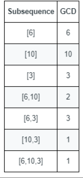

## 题目描述
[leetcode 困难题](https://leetcode.cn/problems/number-of-different-subsequences-gcds/)

给你一个由正整数组成的数组 nums 。

数字序列的 最大公约数 定义为序列中所有整数的共有约数中的最大整数。

例如，序列 [4,6,16] 的最大公约数是 2 。
数组的一个 子序列 本质是一个序列，可以通过删除数组中的某些元素（或者不删除）得到。

例如，[2,5,10] 是 [1,2,1,2,4,1,5,10] 的一个子序列。
计算并返回 nums 的所有 非空 子序列中 不同 最大公约数的 数目 。

示例1：


```
输入：nums = [6,10,3]
输出：5
解释：上图显示了所有的非空子序列与各自的最大公约数。
不同的最大公约数为 6 、10 、3 、2 和 1 。
```

提示1：
```
1 <= nums.length <= 10^5
1 <= nums[i] <= 2 * 10^5
```

## 枚举
由于 $nums.length <= 10^5$ ，我们很难通过对数组序列进行操作来得到答案。

一种思路是因为 $nums[i] <= 2 * 10^5$，由于最大的公约数必然小于数组最大元素，我们可以尝试枚举所有公约数，尝试判断其是否为数组某个序列的最大公约数。

一个结论是如果某个序列 $[a_1, a2...a_i]$ 的最大公约数为 $x$ ，那么所有的 $a_i$ 必然均为 $x$ 的某个倍数，所以我们可以尝试枚举 $x$ 的所有倍数，当他们存在于数组并且最大公约数为 $x$ 时，答案加一。

此时的时间复杂度取决于内层总循环次数，约为 $max + \frac{max}{2} + \frac{max}{3} + ... + 1\approx max*log(max)$ 。[严谨的时间复杂度参考](https://leetcode.cn/problems/number-of-different-subsequences-gcds/solution/ji-bai-100mei-ju-gcdxun-huan-you-hua-pyt-get7/?orderBy=hot) 。

```Java
class Solution {
    public int countDifferentSubsequenceGCDs(int[] nums) {
        int max = Arrays.stream(nums).max().orElseThrow();
        Set<Integer> set = Arrays.stream(nums).boxed().collect(Collectors.toSet());
        int ans = 0;
        for(int i = 1; i <= max; i++){
            int maxGcd = -1;
            for(int j = i; j <= max; j += i){
                if(!set.contains(j)){
                    continue;
                }
                maxGcd = maxGcd == -1 ? j : gcd(maxGcd, j);
                if(maxGcd == i){
                    ans++;
                    break;
                }
            }
        }
        return ans;
    }

    private int gcd(int a, int b){
        while(b != 0){
            int temp = a;
            a = b;
            b = temp % b;
        }
        return a;
    }
}
```