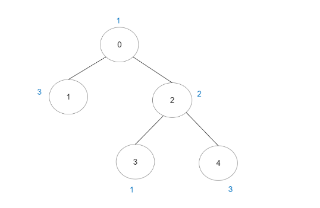

## 题目描述
[leetcode 困难题](https://leetcode.cn/problems/number-of-good-paths/solutions/?orderBy=most_votes)

给你一棵 n 个节点的树（连通无向无环的图），节点编号从 0 到 n - 1 且恰好有 n - 1 条边。

给你一个长度为 n 下标从 0 开始的整数数组 vals ，分别表示每个节点的值。同时给你一个二维整数数组 edges ，其中 edges[i] = [ai, bi] 表示节点 ai 和 bi 之间有一条 无向 边。

一条 好路径 需要满足以下条件：

开始节点和结束节点的值 相同 。
开始节点和结束节点中间的所有节点值都 小于等于 开始节点的值（也就是说开始节点的值应该是路径上所有节点的最大值）。
请你返回不同好路径的数目。

注意，一条路径和它反向的路径算作 同一 路径。比方说， 0 -> 1 与 1 -> 0 视为同一条路径。单个节点也视为一条合法路径。


示例1：


```
输入：vals = [1,3,2,1,3], edges = [[0,1],[0,2],[2,3],[2,4]]
输出：6
解释：总共有 5 条单个节点的好路径。
还有 1 条好路径：1 -> 0 -> 2 -> 4 。
（反方向的路径 4 -> 2 -> 0 -> 1 视为跟 1 -> 0 -> 2 -> 4 一样的路径）
注意 0 -> 2 -> 3 不是一条好路径，因为 vals[2] > vals[0] 。
```

提示1：
```
n == vals.length
1 <= n <= 3 * 10^4
0 <= vals[i] <= 10^5
edges.length == n - 1
edges[i].length == 2
0 <= ai, bi < n
ai != bi
edges 表示一棵合法的树。
```

## 并查集
我们考虑枚举任意等值两点 $a$ 、$b$ 作为好路径的端点时是否合法，按照题意如果它们的路径上所有点都小于 $vals[a]$ 时合法。

稍微将问题转化下，我们从小到大枚举这些等值点，从小到大将小于当前枚举到的点的边加入到树中，那么如果此时这些等值点已经连通，则说明它们之间路径必然不存在更大权值的点，为好路径。

```Java
class Solution {
    public int numberOfGoodPaths(int[] vals, int[][] edges) {
        // sort edge
        Arrays.sort(edges, Comparator.comparingInt(a -> Math.max(vals[a[0]], vals[a[1]])));
        // sort point
        Map<Integer, List<Integer>> sortPoint = new TreeMap<>();
        for (int i = 0; i < vals.length; i++) {
            sortPoint.computeIfAbsent(vals[i], k -> new ArrayList<>())
                    .add(i);
        }
        UF uf = new UF(vals.length);
        int ans = 0;
        int eIndex = 0;
        for (Map.Entry<Integer, List<Integer>> e : sortPoint.entrySet()) {
            // 小于 当前枚举到的最大点 的边都可以连通
            while (eIndex < edges.length && Math.max(vals[edges[eIndex][0]], vals[edges[eIndex][1]]) <= e.getKey()) {
                uf.union(edges[eIndex][0], edges[eIndex][1]);
                eIndex++;
            }
            // 如果此时这些点就联通了, 连通块必然不存在大于这些点的点
            Map<Integer, Integer> cnt = new HashMap<>();
            for (int maxP : e.getValue()) {
                int fa = uf.find(maxP);
                ans += cnt.merge(fa, 1, Integer::sum);
            }
        }
        return ans;
    }
}

class UF{
    int[] fa;
    int[] size;

    public UF(int n) {
        fa = IntStream.range(0, n).toArray();
        size = IntStream.generate(() -> 1).limit(n).toArray();
    }

    void union(int x, int y){
        int fx = find(x);
        int fy = find(y);
        if (fx == fy) {
            return;
        }
        if (size[fx] < size[fy]) {
            fx ^= fy;
            fy ^= fx;
            fx ^= fy;
        }
        fa[fy] = fx;
        size[fx] += size[fy];
    }

    int find(int a){
        if (a != fa[a]) {
            fa[a] = find(fa[a]);
        }
        return fa[a];
    }

}
```