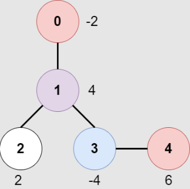

## 题目描述
[leetcode 中等题](https://leetcode.cn/problems/most-profitable-path-in-a-tree/)

一个 n 个节点的无向树，节点编号为 0 到 n - 1 ，树的根结点是 0 号节点。给你一个长度为 n - 1 的二维整数数组 edges ，其中 edges[i] = [ai, bi] ，表示节点 ai 和 bi 在树中有一条边。

在每一个节点 i 处有一扇门。同时给你一个都是偶数的数组 amount ，其中 amount[i] 表示：

- 如果 amount[i] 的值是负数，那么它表示打开节点 i 处门扣除的分数。
- 如果 amount[i] 的值是正数，那么它表示打开节点 i 处门加上的分数。
游戏按照如下规则进行：

- 一开始，Alice 在节点 0 处，Bob 在节点 bob 处。
- 每一秒钟，Alice 和 Bob 分别 移动到相邻的节点。Alice 朝着某个 叶子结点 移动，Bob 朝着节点 0 移动。
- 对于他们之间路径上的 每一个 节点，Alice 和 Bob 要么打开门并扣分，要么打开门并加分。注意：
    - 如果门 已经打开 （被另一个人打开），不会有额外加分也不会扣分。
    - 如果 Alice 和 Bob 同时 到达一个节点，他们会共享这个节点的加分或者扣分。换言之，如果打开这扇门扣 c 分，那么 Alice 和 Bob 分别扣 c / 2 分。如果这扇门的加分为 c ，那么他们分别加 c / 2 分。
- 如果 Alice 到达了一个叶子结点，她会停止移动。类似的，如果 Bob 到达了节点 0 ，他也会停止移动。注意这些事件互相 独立 ，不会影响另一方移动。

请你返回 Alice 朝最优叶子结点移动的 最大 净得分。

示例1：


```
输入：edges = [[0,1],[1,2],[1,3],[3,4]], bob = 3, amount = [-2,4,2,-4,6]
输出：6
解释：
上图展示了输入给出的一棵树。游戏进行如下：
- Alice 一开始在节点 0 处，Bob 在节点 3 处。他们分别打开所在节点的门。
  Alice 得分为 -2 。
- Alice 和 Bob 都移动到节点 1 。
  因为他们同时到达这个节点，他们一起打开门并平分得分。
  Alice 的得分变为 -2 + (4 / 2) = 0 。
- Alice 移动到节点 3 。因为 Bob 已经打开了这扇门，Alice 得分不变。
  Bob 移动到节点 0 ，并停止移动。
- Alice 移动到节点 4 并打开这个节点的门，她得分变为 0 + 6 = 6 。
现在，Alice 和 Bob 都不能进行任何移动了，所以游戏结束。
Alice 无法得到更高分数。
```

提示1：
```
2 <= n <= 10^5
edges.length == n - 1
edges[i].length == 2
0 <= ai, bi < n
ai != bi
edges 表示一棵有效的树。
1 <= bob < n
amount.length == n
amount[i] 是范围 [-10^4, 10^4] 之间的一个 偶数 。
```

## dfs
通过两次 $dfs$ 得出答案。

第一次 $dfs$ 记录 bob 到达每个节点的时间或者不可达。第二遍 $dfs$ 从 $0$ 开始，每次到达某个节点时，将当前时间与 bob 到达该节点的时间比较，按题意得出分数，最后返回所有到叶子路径上可得分数的最大值即可。
```Java
class Solution {
    private int[] amount;
    private Map<Integer, List<Integer>> g;

    public int mostProfitablePath(int[][] edges, int bob, int[] amount) {
        this.amount = amount;
        g = new HashMap<>();
        for (int[] e : edges) {
            g.computeIfAbsent(e[0], k -> new ArrayList<>())
                .add(e[1]);
            g.computeIfAbsent(e[1], k -> new ArrayList<>())
                .add(e[0]);
        }
        int[] bobPathTime = new int[amount.length];
        bobDfs(1, bob, -1, bobPathTime);
        return dfs(1, 0, -1, 0, bobPathTime);
    }

    private boolean bobDfs(int time, int p, int fa, int[] bobPathTime) {
        if (p == 0) {
            bobPathTime[p] = time;
        }
        for (int item : g.get(p)) {
            if (item == fa || !bobDfs(time + 1, item, p, bobPathTime)) {
                continue;
            }
            bobPathTime[p] = time;
        }
        return bobPathTime[p] != 0;
    }

    private int dfs(int time, int p, int fa, int score, int[] bobPathTime) {
        int max = Integer.MIN_VALUE;
        for (int item : g.get(p)) {
            if (item == fa) {
                continue;
            }
            max = Math.max(max, dfs(time + 1, item, p, score, bobPathTime));
        }
        int realAmount = 0;
        if(time < bobPathTime[p] || bobPathTime[p] == 0){
            realAmount = amount[p];
        }
        if(time == bobPathTime[p]){
            realAmount = amount[p] / 2;
        }
        return (max == Integer.MIN_VALUE ? 0 : max) + realAmount; // max == Integer.MAX_VALUE 为当前在某个叶子节点的情况 并且因为得分存在负数 所以不能初始化为 0
    }
}
```
```Java
// by arignote
class Solution {

    public int mostProfitablePath(int[][] edges, int bob, int[] amount) {
        HashMap<Integer, ArrayList<Integer>> map = new HashMap<>();
        for (int[] edge : edges) {
            map.computeIfAbsent(edge[0], t -> new ArrayList<>()).add(edge[1]);
            map.computeIfAbsent(edge[1], t -> new ArrayList<>()).add(edge[0]);
        }
        int[] dist = new int[amount.length];
        mostProfitablePath(Integer.MIN_VALUE, bob, -1, dist, map);
        return mostProfitablePath(Integer.MIN_VALUE, 0, -1, dist, amount, map);
    }

    private boolean mostProfitablePath(int i, int p, int j, int[] dist,
                                        HashMap<Integer, ArrayList<Integer>> map) {
        dist[p] = p == 0 ? i : dist[p];
        for (int k : map.get(p)) {
            if(k == j || mostProfitablePath(i + 1, k, p, dist, map)){
                continue;
            }
            dist[p] = i;
        }
        return dist[p] >= 0;
    }

    private int mostProfitablePath(int i, int j, int k, int[] dist, int[] amount,
                                    HashMap<Integer, ArrayList<Integer>> map) {
        int max = Integer.MIN_VALUE;
        for (int l : map.get(j)) {
            max = Math.max(max, l == k ? Integer.MIN_VALUE : mostProfitablePath(i + 1, l, j, dist, amount, map));
        }
        return (max > Integer.MIN_VALUE ? max : 0) + (i > dist[j] ? 0 : amount[j] / (i < dist[j] ? 1 : 2));
    }
}
```
