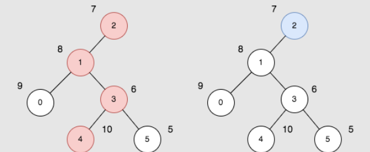

## 题目描述
[leetcode 困难题](https://leetcode.cn/problems/difference-between-maximum-and-minimum-price-sum/)

给你一个 n 个节点的无向无根图，节点编号为 0 到 n - 1 。给你一个整数 n 和一个长度为 n - 1 的二维整数数组 edges ，其中 edges[i] = [ai, bi] 表示树中节点 ai 和 bi 之间有一条边。

每个节点都有一个价值。给你一个整数数组 price ，其中 price[i] 是第 i 个节点的价值。

一条路径的 价值和 是这条路径上所有节点的价值之和。

你可以选择树中任意一个节点作为根节点 root 。选择 root 为根的 开销 是以 root 为起点的所有路径中，价值和 最大的一条路径与最小的一条路径的差值。

请你返回所有节点作为根节点的选择中，最大 的 开销 为多少。

示例1：


```
输入：n = 6, edges = [[0,1],[1,2],[1,3],[3,4],[3,5]], price = [9,8,7,6,10,5]
输出：24
解释：上图展示了以节点 2 为根的树。左图（红色的节点）是最大价值和路径，右图（蓝色的节点）是最小价值和路径。
- 第一条路径节点为 [2,1,3,4]：价值为 [7,8,6,10] ，价值和为 31 。
- 第二条路径节点为 [2] ，价值为 [7] 。
最大路径和与最小路径和的差值为 24 。24 是所有方案中的最大开销。
```

提示1：
```
1 <= n <= 10^5
edges.length == n - 1
0 <= ai, bi <= n - 1
edges 表示一棵符合题面要求的树。
price.length == n
1 <= price[i] <= 10^5
```

## 树形DP
由于价值均为正数，所以最大价值路径必然是越长越好直到遇到叶子节点，反之最小价值路径则越短越好只包含根节点。

问题转换成去掉一个叶子节点后的最大价值路径（去掉的叶子节点即为所选的根节点）。

定义 $dfs(node)$ 返回 $[max1, max2]$ ，分别表示以 $node$ 为根节点的 `[最大不带叶子节点路径价值，最大带叶子节点路径价值]` ，那么 $ans$ 为 `max(ans, max(之前最大不带叶子节点路径 + 当前最大带叶子节点路径，之前最大带叶子节点路径 + 当前最大不带叶子节点路径))` 。

```Java
class Solution {
    private List<Integer>[] tree;
    private int[] price;
    private long ans;

    public long maxOutput(int n, int[][] edges, int[] price) {
        this.tree = (List<Integer>[])new List[n];
        Arrays.setAll(tree, __ -> new ArrayList<>());
        for(int[] e : edges){
            tree[e[0]].add(e[1]);
            tree[e[1]].add(e[0]);
        }
        this.price = price;
        dfs(0, -1);
        return ans;
    }

    // [不带叶子节点路径, 带叶子节点路径]
    private long[] dfs(int node, int father){
        long max1 = 0, max2 = price[node];
        for(int p : tree[node]){
            if(p == father){
                continue;
            }
            long[] result = dfs(p, node);
            ans = Math.max(ans, Math.max(result[0] + max2, result[1] + max1));
            max1 = Math.max(max1, result[0] + price[node]);
            max2 = Math.max(max2, result[1] + price[node]);
        }
        return new long[]{max1, max2};
    }
}
```
