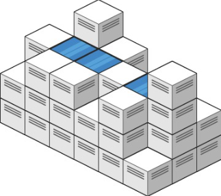

## 题目描述
[leetcode 困难题](https://leetcode.cn/problems/trapping-rain-water-ii/)

给你一个 m x n 的矩阵，其中的值均为非负整数，代表二维高度图每个单元的高度，请计算图中形状最多能接多少体积的雨水。

示例1：


```
输入: heightMap = [[1,4,3,1,3,2],[3,2,1,3,2,4],[2,3,3,2,3,1]]
输出: 4
解释: 下雨后，雨水将会被上图蓝色的方块中。总的接雨水量为1+2+1=4。
```

提示1：
```
m == heightMap.length
n == heightMap[i].length
1 <= m, n <= 200
0 <= heightMap[i][j] <= 2 * 10^4
```

## Dijkstra 单源最短路
不同于 [接雨水](https://leetcode.cn/problems/trapping-rain-water/) ，二维矩阵下某个点 $[i][j]$ 能接到多少雨水取决的是从该点到边界的所有路径上最大高度的最小值，该最小值减去 $heightMap[i][j]$ 后就为该点所接到的雨水量。当然，边界点自身是接不了水的。

容易想到最短路算法，我们可以将问题转换成求从所有边界到每个点所有最大高度的最短路径，此时为多源最短路问题，但我们可以将其转换成单源问题，设每个边界点都存在一条边连着一个超级源点，该边的权值为 $0$ ，那么问题转换成求从超级源点到每个点的所有最大高度的最短路径，可以使用 $Dijkstra$ 算法求解，这里使用优先堆的实现。

当然我们不需要真的构建超级源点，由于超级源点连向边界点的边权值都为 $0$ ，那么根据 $Dijkstra$ 的过程，其实也就等价于初始时将所有边界点入堆。

不同于普通的最短路，这里我们求的是所有路径上最大高度的最小值，其中最小值的正确性类似最短路由 $Dijkstra$ 算法保证，而每条路径上的最大高度，需要我们自己维护，我们只需要将原有更新最短路长度变形为更新该路径上的最大高度即可。
```Java
class Solution {
    public int trapRainWater(int[][] heightMap) {
        int m = heightMap.length;
        int n = heightMap[0].length;
        PriorityQueue<int[]> min = new PriorityQueue<>((a, b) -> a[2] - b[2]);
        int[][] visit = new int[m][n];
        for(int i = 0; i < n; i++){
            min.offer(new int[]{0, i, heightMap[0][i]});
            min.offer(new int[]{m - 1, i, heightMap[m - 1][i]});
            visit[0][i] = 1;
            visit[m - 1][i] = 1;
        }
        for(int i = 1; i < m; i++){
            min.offer(new int[]{i, 0, heightMap[i][0]});
            min.offer(new int[]{i, n - 1, heightMap[i][n - 1]});
            visit[i][0] = 1;
            visit[i][n - 1] = 1;
        }
        int[][] dirs = new int[][]{{1, 0}, {-1, 0}, {0, 1}, {0, -1}};
        int ans = 0;
        while(!min.isEmpty()){
            int[] top = min.poll();
            for(int[] item : dirs){
                int nextI = top[0] + item[0];
                int nextJ = top[1] + item[1];
                if(!check(nextI, nextJ, m, n) || visit[nextI][nextJ] == 1){
                    continue;
                }
                int nextHeight = Math.max(top[2], heightMap[nextI][nextJ]); // 最大高度必然大于等于边界高度，所以可以从最小边界开始
                ans += nextHeight - heightMap[nextI][nextJ];
                min.offer(new int[]{nextI, nextJ, nextHeight}); // 等价松弛
                visit[nextI][nextJ] = 1;
            }
        }
        return ans;
    }

    private boolean check(int i, int j, int m, int n){
        return i >= 0 && i < m && j >= 0 && j < n;
    }
}
```
