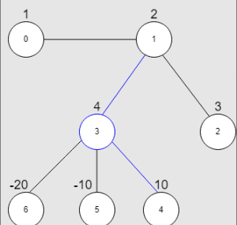

## 题目描述
[leetcode 中等题](https://leetcode.cn/problems/maximum-star-sum-of-a-graph/)

给你一个 n 个点的无向图，节点从 0 到 n - 1 编号。给你一个长度为 n 下标从 0 开始的整数数组 vals ，其中 vals[i] 表示第 i 个节点的值。

同时给你一个二维整数数组 edges ，其中 edges[i] = [ai, bi] 表示节点 ai 和 bi 之间有一条双向边。

星图 是给定图中的一个子图，它包含一个中心节点和 0 个或更多个邻居。换言之，星图是给定图中一个边的子集，且这些边都有一个公共节点。

下图分别展示了有 3 个和 4 个邻居的星图，蓝色节点为中心节点。


星和 定义为星图中所有节点值的和。

给你一个整数 k ，请你返回 至多 包含 k 条边的星图中的 最大星和 。

示例1：


```
输入：vals = [1,2,3,4,10,-10,-20], edges = [[0,1],[1,2],[1,3],[3,4],[3,5],[3,6]], k = 2
输出：16
解释：上图展示了输入示例。
最大星和对应的星图在上图中用蓝色标出。中心节点是 3 ，星图中还包含邻居 1 和 4 。
无法得到一个和大于 16 且边数不超过 2 的星图。
```

提示1：
```
n == vals.length
1 <= n <= 10^5
-10^4 <= vals[i] <= 10^4
0 <= edges.length <= min(n * (n - 1) / 2, 10^5)
edges[i].length == 2
0 <= ai, bi <= n - 1
ai != bi
0 <= k <= n - 1
```

## 排序 + 暴力枚举
注意题目中：星图是给定图中一个边的子集，且**这些边都有一个公共节点**。

所以我们可以直接暴力枚举所有中心点，并根据 $vals$ 中的值对该点上的边进行排序，从而找出所有点中的最大值即可。

当然由于 $val$ 可能为负数，且题目为“至多包含k条边”，所以当权值出现负数时，该点就不需要继续往下添加边。

```Java
// List 版本
class Solution {
    public int maxStarSum(int[] vals, int[][] edges, int k) {
        int n = vals.length;
        List<Integer>[] g = new List[n];
        Arrays.setAll(g, i -> new ArrayList<>());
        for(int i = 0; i < edges.length; i++){
            g[edges[i][0]].add(vals[edges[i][1]]);
            g[edges[i][1]].add(vals[edges[i][0]]);
        }
        int ans = vals[0];
        for(int i = 0; i < n; i++){
            int cur = vals[i];
            Collections.sort(g[i]);
            for(int j = g[i].size() - 1; j >= 0 && j > g[i].size() - 1 - k; j--){
                if(g[i].get(j) <= 0){
                    break;
                }
                cur += g[i].get(j);
            }
            ans = Math.max(ans, cur);
        }
        return ans;
    }
}
```
```Java
// 优先队列版本
class Solution {
    public int maxStarSum(int[] vals, int[][] edges, int k) {
        int n = vals.length;
        PriorityQueue<Integer>[] g = new PriorityQueue[n];
        Arrays.setAll(g, i -> new PriorityQueue<Integer>((a, b) -> b - a));
        for(int i = 0; i < edges.length; i++){
            g[edges[i][0]].offer(vals[edges[i][1]]);
            g[edges[i][1]].offer(vals[edges[i][0]]);
        }
        int ans = vals[0];
        for(int i = 0; i < n; i++){
            int cur = vals[i];
            int count = 0;
            while(!g[i].isEmpty() && count < k){
                if(g[i].peek() <= 0){
                    break;
                }
                cur += g[i].poll();
                count++;
            }
            ans = Math.max(ans, cur);
        }
        return ans;
    }
}
```
```Java
//https://leetcode.cn/u/arignote/
class Solution {

public int maxStarSum(int[] vals, int[][] edges, int k) {
    HashMap<Integer, PriorityQueue<Integer>> map = new HashMap<>();
    for (int[] edge : edges) {
        map.computeIfAbsent(edge[0], t -> new PriorityQueue<>()).offer(-vals[edge[1]]);
        map.computeIfAbsent(edge[1], t -> new PriorityQueue<>()).offer(-vals[edge[0]]);
    }
    int max = Integer.MIN_VALUE;
    for (int i = 0; i < vals.length; i++) {
        for (int j = 0; j < k && map.containsKey(i) && !map.get(i).isEmpty() && map.get(i).peek() < 0; j++) {
            vals[i] -= map.get(i).poll();
        }
        max = Math.max(max, vals[i]);
    }
    return max;
}
}
```