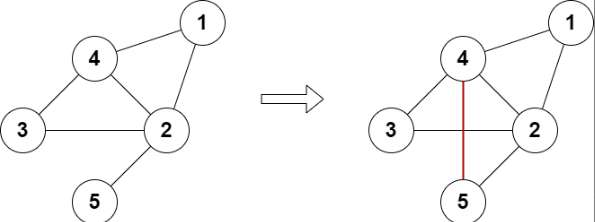

## 题目描述
[leetcode 困难题](https://leetcode.cn/problems/add-edges-to-make-degrees-of-all-nodes-even/submissions/)

给你一个有 n 个节点的 无向 图，节点编号为 1 到 n 。再给你整数 n 和一个二维整数数组 edges ，其中 edges[i] = [ai, bi] 表示节点 ai 和 bi 之间有一条边。图不一定连通。

你可以给图中添加 至多 两条额外的边（也可以一条边都不添加），使得图中没有重边也没有自环。

如果添加额外的边后，可以使得图中所有点的度数都是偶数，返回 true ，否则返回 false 。

点的度数是连接一个点的边的数目。

示例1：

```
输入：n = 5, edges = [[1,2],[2,3],[3,4],[4,2],[1,4],[2,5]]
输出：true
解释：上图展示了添加一条边的合法方案。
最终图中每个节点都连接偶数条边。
```

提示1：
```
3 <= n <= 10^5
2 <= edges.length <= 10^5
edges[i].length == 2
1 <= ai, bi <= n
ai != bi
图中不会有重边
```

## 分类讨论
由于最多只能加两条边，显然如果度数为奇数的边数大于4时，返回 $false$。 

讨论小于等于4的情况：
- 0：直接返回 $true$ 即可。
- 1：由于不能存在自环，无法满足题意，直接返回 $false$ 。
- 2：设两点分别为 $a$ 、$b$ ，如果 $a$ 、$b$ 之间不存在边，添加一条边即可；否则需要存在一个公共点，该公共点与 $a$ 、$b$ 均不存在边。
- 3: 与1的情况类似，直接返回 $false$ 。
- 4: 由于只能添加两条边，所以只能尝试添加两条边分别连接四个点，如果合法返回 $true$ 。
```Java
class Solution {
    public boolean isPossible(int n, List<List<Integer>> edges) {
        Set<Integer>[] g = new Set[n + 1];
        Arrays.setAll(g, i -> new HashSet<>()); g[0] = null;
        for(List<Integer> e : edges){
            g[e.get(0)].add(e.get(1));
            g[e.get(1)].add(e.get(0));
        }
        List<Integer> p = IntStream.range(0, n + 1).boxed()
                                .filter(i -> g[i] != null && (g[i].size() & 1) == 1)
                                .collect(Collectors.toList());
        if(p.size() == 2){
            // 两点相连 或者 连一个公共点
            for(Set<Integer> point : g){
                if(point != null && 
                    !point.contains(p.get(0)) && !point.contains(p.get(1))){
                    return true;
                }
            }
        }
        if(p.size() == 4){
            int a = p.get(0);
            int b = p.get(1);
            int c = p.get(2);
            int d = p.get(3);
            // ab cd, ac bd, ad bc
            return (!g[a].contains(b) && !g[c].contains(d))
                || (!g[a].contains(c) && !g[b].contains(d))
                || (!g[a].contains(d) && !g[b].contains(c));
        }
        return p.isEmpty();
    }
}
```
短但可读性差
```Java
class Solution {
    public boolean isPossible(int n, List<List<Integer>> edges) {
        Set<Integer>[] g = new Set[n + 1];
        Arrays.setAll(g, i -> new HashSet<>()); g[0] = null;
        for(List<Integer> e : edges){
            g[e.get(0)].add(e.get(1));
            g[e.get(1)].add(e.get(0));
        }
        List<Integer> p = IntStream.range(0, n + 1).boxed()
                .filter(i -> g[i] != null && (g[i].size() & 1) == 1)
                .collect(Collectors.toList());
        return p.isEmpty()
                || p.size() == 2 && Arrays.stream(g).anyMatch(point -> point != null && !point.contains(p.get(0)) && !point.contains(p.get(1)))
                || p.size() == 4 && 
                    ((!g[p.get(0)].contains(p.get(1)) && !g[p.get(2)].contains(p.get(3)))
                    || (!g[p.get(0)].contains(p.get(2)) && !g[p.get(1)].contains(p.get(3)))
                    || (!g[p.get(0)].contains(p.get(3)) && !g[p.get(1)].contains(p.get(2))));
    }
}
```