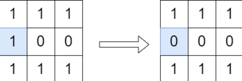

## 题目描述
[leetcode 中等题](https://leetcode.cn/problems/disconnect-path-in-a-binary-matrix-by-at-most-one-flip/)

给你一个下标从 0 开始的 m x n 二进制 矩阵 grid 。你可以从一个格子 (row, col) 移动到格子 (row + 1, col) 或者 (row, col + 1) ，前提是前往的格子值为 1 。如果从 (0, 0) 到 (m - 1, n - 1) 没有任何路径，我们称该矩阵是 不连通 的。

你可以翻转 最多一个 格子的值（也可以不翻转）。你 不能翻转 格子 (0, 0) 和 (m - 1, n - 1) 。

如果可以使矩阵不连通，请你返回 true ，否则返回 false 。

注意 ，翻转一个格子的值，可以使它的值从 0 变 1 ，或从 1 变 0 。

示例1：


```
输入：grid = [[1,1,1],[1,0,0],[1,1,1]]
输出：true
解释：按照上图所示我们翻转蓝色格子里的值，翻转后从 (0, 0) 到 (2, 2) 没有路径。
```

提示1：
```
m == grid.length
n == grid[i].length
1 <= m, n <= 1000
1 <= m * n <= 10^5
grid[0][0] == grid[m - 1][n - 1] == 1
```

## 遍历轮廓
下轮廓：优先向下走，否则再向右走

右轮廓：优先向右走，否则再向下走

一个结论是：如果两个轮廓有交集（除了起点终点），那么翻转交集中的任意一个格子，都可以使矩阵不连通。

实际代码中，可以在遍历某个轮廓时，直接将该轮廓的所有点翻转，那么假设第二次出发还能到达终点，则无法使矩阵不连通。
```Java
class Solution {
    int m;
    int n;

    public boolean isPossibleToCutPath(int[][] grid) {
        m = grid.length;
        n = grid[0].length;
        if(!clean(grid, 0, 0)){
            return true;
        }
        Queue<int[]> queue = new ArrayDeque<>();
        queue.offer(new int[]{0, 0});
        int cnt = 0;
        while(!queue.isEmpty()){
            int[] index = queue.poll();
            if(index[0] == m - 1 && index[1] == n - 1){
                return false;
            }
            if(index[0] + 1 < m && grid[index[0] + 1][index[1]] == 1){
                grid[index[0] + 1][index[1]] = 0;
                queue.offer(new int[]{index[0] + 1, index[1]});
            }
            if(index[1] + 1 < n && grid[index[0]][index[1] + 1] == 1){
                grid[index[0]][index[1] + 1] = 0;
                queue.offer(new int[]{index[0], index[1] + 1});
            }
        }
        return true;
    }

    private boolean clean(int[][] grid, int x, int y){
        if(y == m - 1 && x == n - 1){
            return true;
        }
        grid[y][x] = 0;
        if(x + 1 < n && grid[y][x + 1] == 1){   
            return clean(grid, x + 1, y);
        }
        if(y + 1 < m && grid[y + 1][x] == 1){
            return clean(grid, x, y + 1);
        }
        return false;
    }
}
```
注意到可以通过一个通用的 $dfs$ 来满足两次遍历的需求，还可以用 $逻辑与$ 来实现优先某个方向的逻辑。
```Java
class Solution {
    int[][] grid;
    int m;
    int n;

    public boolean isPossibleToCutPath(int[][] grid) {
        this.grid = grid;
        m = grid.length;
        n = grid[0].length;
        return !dfs(0, 0) || !dfs(0, 0);
    }

    private boolean dfs(int x, int y){
        if(y == m - 1 && x == n - 1){
            return true;
        }
        grid[y][x] = 0;
        return (x + 1 < n && grid[y][x + 1] == 1 && dfs(x + 1, y)) ||
                (y + 1 < m && grid[y + 1][x] == 1 && dfs(x, y + 1));
    }
}
```
