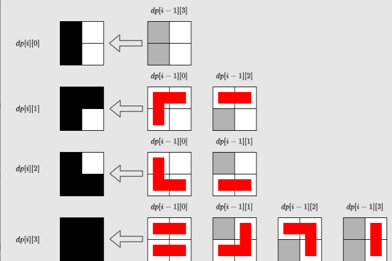

## 题目描述
[leetcode 中等题](https://leetcode.cn/problems/domino-and-tromino-tiling/)

有两种形状的瓷砖：一种是 2 x 1 的多米诺形，另一种是形如 "L" 的托米诺形。两种形状都可以旋转。


给定整数 n ，返回可以铺满 2 x n 的面板的方法的数量。返回对 10e9 + 7 取模 的值。

**注意下图中的 1-3 方案，是白色瓷砖而不是没铺满，不要产生误解**


## 找规律
- f(1) = 1
- f(2) = 2
- f(3) = 5
- f(4) = 11 = 5 * 2 + 1 = f(3) * 2 + f(1)
- f(5) = 24 = 11 * 2 + 2 = f(4) * 2 + f(2) 

得出 `f(i) = 2 * (f - i) + f(i - 3)`，其中 `i > 3` 
```Java
class Solution {
    static final int  MOD = (int)(1e9 + 7);

    public int numTilings(int n) {
        int[] f = new int[n + 10];
        f[1] = 1;
        f[2] = 2;
        f[3] = 5;
        for(int i = 4; i <= n; i++){
            f[i] = (((2 * f[i - 1]) % MOD) + f[i - 3]) % MOD;
        }        
        return f[n];
    }
}
```
## 找规律 + 滚动数组
可以发现最多会往前依赖到 `i - 3`，那么只需要保存最近的三个结果即可。

但这里为了方便（抖机灵），保存了 `4` 个结果。因为对 `2` 的 `n` 次方的取模运算，可以转换成对 `n - 1` 的与运算。
```Java
class Solution {
    static final int  MOD = (int)(1e9 + 7);

    public int numTilings(int n) {
        int[] f = new int[4];
        f[1] = 1;
        f[2] = 2;
        f[3] = 5;
        for(int i = 4; i <= n; i++){
            int cur = i & 3, pre = i - 1 & 3, magic = i - 3 & 3;
            f[cur] = (((2 * f[pre]) % MOD) + f[magic]) % MOD;
        }        
        return f[n & 3];
    }
}
```

这种类型的题目由于结果固定，且数据范围有限，还能用第一种解法 + 打表对结果进行保存，由于做法类似就不在这里列出了。

## 动态规划
定义 `dp[i][j]` 为： 在第 `i` 列前面的正方形都被瓷砖覆盖，当前第 `i` 列状态为 `j` 时的方案数。那么第 `i` 列的正方形有四种（即 `j` 取值范围）被覆盖的情况：

第 `i` 列为空，`j` 为 `0`；

第 `i` 列上方格子为空，`j`为 `1`；

第 `i` 列下方格子为空，`j`为 `2`；

第 `i` 列为满，`j`为 `3`。

那么状态转移如下:



```Java
class Solution {
    static final int  MOD = (int)(1e9 + 7);

    public int numTilings(int n) {
        int[][] dp = new int[n + 1][4];
        dp[0][3] = 1;
        for(int i = 1; i < n + 1; i++){
            dp[i][0] = dp[i - 1][3];
            dp[i][1] = (dp[i - 1][0] + dp[i - 1][2]) % MOD;
            dp[i][2] = (dp[i - 1][0] + dp[i - 1][1]) % MOD;
            dp[i][3] = (((dp[i - 1][0] + dp[i - 1][3]) % MOD + dp[i - 1][1]) % MOD + dp[i - 1][2]) % MOD;
        }
        return dp[n][3];
    }
}
```
## 动态规划 + 滚动数组
类似于 `找规律 + 滚动数组` 的优化，`dp[i]`只往前依赖于 `dp[i - 1]`，所以可以把数组的第一维优化成 `2`。

稍微要注意的是，由于 `0、1、2、3` 状态之间存在相互依赖，所以无法优化成一维数组。
```Java
class Solution {
    static final int  MOD = (int)(1e9 + 7);

    public int numTilings(int n) {
        int[][] dp = new int[2][4];
        dp[0][3] = 1;
        for(int i = 1; i < n + 1; i++){
            int cur  = i & 1, pre = i - 1 & 1;
            dp[cur][0] = dp[pre][3];
            dp[cur][1] = (dp[pre][0] + dp[pre][2]) % MOD;
            dp[cur][2] = (dp[pre][0] + dp[pre][1]) % MOD;
            dp[cur][3] = (((dp[pre][0] + dp[pre][3]) % MOD + dp[pre][1]) % MOD + dp[pre][2]) % MOD;
        }
        return dp[n & 1][3];
    }
}
```
## 矩阵快速幂
```Java
class Solution {
    static final int  MOD = (int)(1e9 + 7);

    public int numTilings(int n) {
        int[][] matrix = new int[][]{
            {0, 0, 0, 1},
            {1, 0, 1, 0},
            {1, 1, 0, 0},
            {1, 1, 1, 1}
        };
        int[][] ans = new int[][]{
            {1, 0, 0, 0},
            {0, 1, 0, 0},
            {0, 0, 1, 0},
            {0, 0, 0, 1}
        };
        while(n > 0){
            if((n & 1) == 1){
                ans = mul(matrix, ans);
            }
            matrix = mul(matrix, matrix);
            n >>= 1;
        }
        // 应该等价
        // int[] first = new int[]{0, 0, 0, 1};
        // return ans[3][0] * first[0] + ans[3][1] * first[1] + ans[3][2] * first[2] + ans[3][3] * first[3];
        return ans[3][3];
    }

    private int[][] mul(int[][] a, int[][] b){
        int[][] ret = new int[a.length][a.length];
        for(int i = 0; i < a.length; i++){
            for(int j = 0; j < a.length; j++){
                for(int k = 0; k < a.length; k++){
                    ret[i][j] = (int)((ret[i][j] + (long) a[i][k] * b[k][j]) % MOD);
                }
            }
        }
        return ret;
    }
}
```