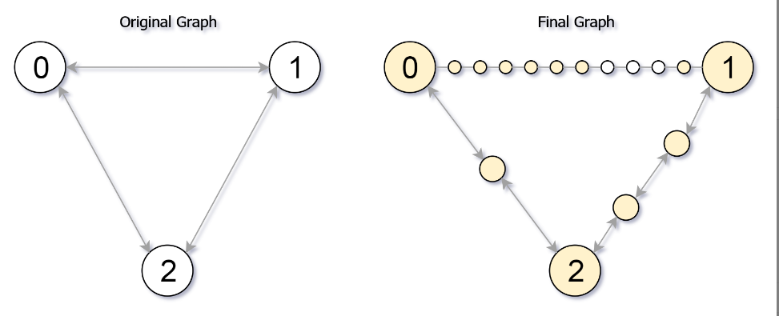

## 题目描述
[leetcode 困难题](https://leetcode.cn/problems/reachable-nodes-in-subdivided-graph/)

给你一个无向图（原始图），图中有 n 个节点，编号从 0 到 n - 1 。你决定将图中的每条边 细分 为一条节点链，每条边之间的新节点数各不相同。

图用由边组成的二维数组 edges 表示，其中 edges[i] = [ui, vi, cnti] 表示原始图中节点 ui 和 vi 之间存在一条边，cnti 是将边 细分 后的新节点总数。注意，cnti == 0 表示边不可细分。

要 细分 边 [ui, vi] ，需要将其替换为 (cnti + 1) 条新边，和 cnti 个新节点。新节点为 x1, x2, ..., xcnti ，新边为 [ui, x1], [x1, x2], [x2, x3], ..., [xcnti+1, xcnti], [xcnti, vi] 。

现在得到一个 新的细分图 ，请你计算从节点 0 出发，可以到达多少个节点？如果节点间距离是 maxMoves 或更少，则视为 可以到达 。

给你原始图和 maxMoves ，返回 新的细分图中从节点 0 出发 可到达的节点数 。


示例1：

```
输入：edges = [[0,1,10],[0,2,1],[1,2,2]], maxMoves = 6, n = 3
输出：13
解释：边的细分情况如上图所示。
可以到达的节点已经用黄色标注出来。
```

提示1：
```
0 <= edges.length <= min(n * (n - 1) / 2, 104)
edges[i].length == 3
0 <= ui < vi < n
图中 不存在平行边
0 <= cnti <= 104
0 <= maxMoves <= 109
1 <= n <= 3000
```

## Dijkstra 算法
将 $cnt_i$ 看成类似权值，再通过 [Dijkstra](https://oi-wiki.org/graph/shortest-path/#dijkstra-%E7%AE%97%E6%B3%95) 算法得到每个原始点到 $0$ 的最短路径即可。

需要注意的有两点：
1. 计算距离的时候要使用 $cnt + 1$ ，因为还要加上原始节点的消耗。
2. 得到最短路径后，计算 `可达点` 总数时需要将 `原始节点` 和 `拆分节点` 分开来计算避免重复计算原始点。对于原始节点，当 $d[i]$ 小于 $maxMoves$ 时，即为可达；而对于拆分节点，通过遍历所有边得出，对于某条边 $e(u, v)$ ，该边的可达的拆分点显然为经过 $u$ 点可达的拆分点与经过 $v$ 点可达的拆分点交集，设两者数量分别为 $u_x$ 和 $v_x$ 、该边拆分点总数为 $all$，那么该边可达的拆分点总数即为 $min(all, u_x + v_x)$ ，注意这里的 $min(all, )$ 相当于去了重。
```Java
class Solution {

    public int reachableNodes(int[][] edges, int maxMoves, int n) {
        // Build graph
        List<int[]>[] g = new List[n];
        Arrays.setAll(g, k -> new ArrayList());
        for(int i = 0; i < edges.length; i++){
            g[edges[i][0]].add(new int[]{edges[i][1], edges[i][2] + 1}); // +1, 因为还要算上原始点的距离
            g[edges[i][1]].add(new int[]{edges[i][0], edges[i][2] + 1});
        }
        // dijkstra
        PriorityQueue<int[]> min = new PriorityQueue<>((a, b) -> a[1] - b[1]);
        min.offer(new int[]{0, 0});
        int[] d = new int[n];
        Arrays.fill(d, Integer.MAX_VALUE);
        d[0] = 0;
        Set<Integer> visit = new HashSet<>();
        while(!min.isEmpty()){
            int[] top = min.poll();
            if(!visit.add(top[0])){
                continue;
            }
            for(int[] p : g[top[0]]){
                if(d[p[0]] > d[top[0]] + p[1]){
                    d[p[0]] = d[top[0]] + p[1]; // 对该点的所有出边执行松弛操作
                    min.offer(new int[]{p[0], d[p[0]]});
                }
            }
        }
        int ans = 0;
        // 原始点和拆分点分开来算
        for(int item : d){
            if(item <= maxMoves){
                ans++;
            }
        }
        for(int[] e : edges){
            int a = Math.max(0, maxMoves - d[e[0]]);
            int b = Math.max(0, maxMoves - d[e[1]]);
            ans += Math.min(e[2], a + b);
        }
        return  ans;
    }

}
```