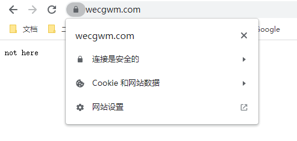
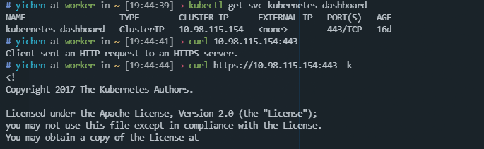
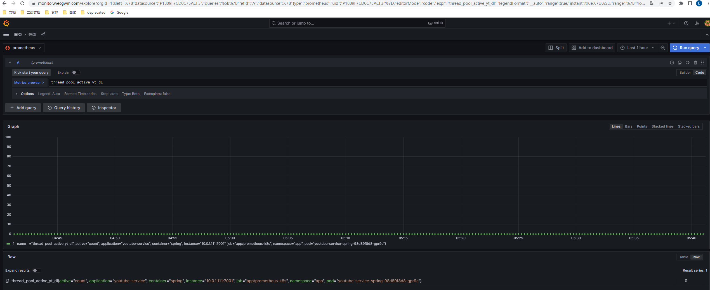
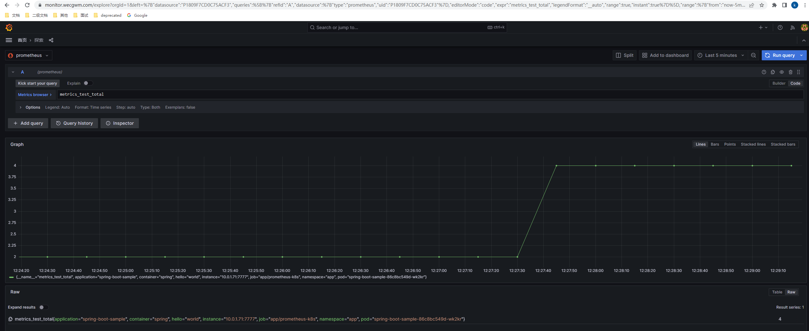

## 目标
基础设施：[Kubernetes](https://kubernetes.io/zh-cn/docs/home/)、[Helm](https://helm.sh/)、[Ingress-nginx](https://github.com/kubernetes/ingress-nginx)、[kubernetes-dashboard](https://github.com/kubernetes/dashboard)、[Prometheus](https://prometheus.io/)、[Grafana](https://grafana.com/)、[Github-Action](https://github.com/actions/runner)

最终效果是实现例如 `spring boot` 项目开发完毕提交到 `github` 后，可以自动化部署到 `kubernetes` 集群上，能直接通过 $https$ 路径 `https://www.wecgwm.com/spring-boot-sample/up` 访问，基础指标和自定义指标可以选择性的暴露给 `prometheus`，且可以通过 `Grafana` 和 `dashboard` 进行管理。

## 内容
本文不会过多的写关于 `k8s` 中的概念以及一些其他服务的部署细节，因为更好的做法是直接参考[官方文档](https://kubernetes.io/zh-cn/docs/home/)。

主要是记录整体的搭建流程，以及记录一些官方文档中没提及、有收获的、花费了较多时间的问题，最后就是一些存在疑惑的地方也会记录下来。
## 环境
VPS： [Vultr](https://www.vultr.com/)，两台 `4G`、两核的 `Debian11`。

域名：[Cloud flare](https://dash.cloudflare.com/login)，提供免费的代理和 `SSL/TLS` 证书管理功能。

## Kubernetes、Helm
> 远程服务有更高昂的调用成本，但这是为组件带来隔离与自治能力的必要代价

`k8s` 的官方文档还是写的很详细的，基本上只要按照文档中的步骤进行部署即可，遇到的问题也能直接在官方文档的 `FAQ` 等地方中找到。网络插件选择了 [cilium](https://github.com/cilium/cilium)。

`Helm` 的部署比较简单，就不说了。
## 部署方式

对于以下项目的部署一般存在两种方式：`yaml清单` 或者 `Helm` ，这里不会单独选择某种方式，这是因为不同项目实际上对于不同部署方式的支持程度并不一致。

举例来说目前对于 `Ingress-nginx` 建议使用 `Helm` 的方式，这是因为目前该项目的成员在回复 `issue` 时基本都是采用 `helm show values` 的方式。

而对于 `kube-prometheus` 项目更建议使用 `yaml清单` 的方式部署，因为该项目的 `helm chart` 并不由 `kube-prometheus` 项目[维护](https://github.com/prometheus-operator/prometheus-operator/issues/3169)，所以可以看到很多 `issue` 只要是使用了 `Helm` 进行部署的，基本会被直接 close 。

总的来说最好是按照官方文档推荐的部署方式进行部署，如果文档没有指出，最好能够过一下 `issue` ，看下项目成员更支持哪种部署方式。

## Ingress-nginx
> `Kubernetes` 集群内的服务访问方式有 `CluterIp` 等，而集群外的访问方式有 `NodePort`、`port-forward`、`LoadBalancer`、`ingress`。
> 
> 而为了让 Ingress 资源工作，集群必须有一个正在运行的 Ingress 控制器。

实际上感觉裸机集群部署 `ingress-nginx` 的难度要更大点，大概原因是因为裸机集群没有开箱即用的 `LoadBalancer` 类型的 `service`，更详细的可以参考[这里](https://kubernetes.github.io/ingress-nginx/deploy/baremetal/)。

可以看到 [当前文档](https://kubernetes.github.io/ingress-nginx/deploy/baremetal/) 中对于裸机集群主要有以下几种解决方案：

1. MetalLB
2. NodePort
3. 主机网络
4. 自配置边缘
5. 外部ip
   
而官方比较推荐的是第一种方案，实际上在一些 [issue](https://github.com/kubernetes/ingress-nginx/issues/9749) 中也可以看到对于裸机集群出现的问题，维护者都是假设使用了 `MetalLB`， 甚至对于没有使用 `MetalLB` 的用户，无法提供很好的支持。

所以实际上一开始我也是使用的 `MetalLB` 方式进行部署，而对于 `MetalLB`:
> In short, it allows you to create Kubernetes services of type LoadBalancer in clusters that don’t run on a cloud provider

可以看到，该服务实际上就是为了解决裸机集群没有 `LoadBalancer` 问题的，**此时看起来一切很合理**。而该项目有两种模式，分别是: `第二层模式`、`BGP模式`。

第二层模式需要一个 `ip` 地址池，好在 `Vultr` 的 `ip` 地址并不贵，所以也能接受，但主要问题是比较详细的看完二层模式后，如该项目的官方文档所说：
```
在第 2 层模式下，服务 IP 的所有流量都会流向一个节点。从那里， kube-proxy将流量传播到所有服务的 Pod。
从这个意义上说，第 2 层没有实现负载均衡器。相反，它实现了故障转移机制，以便在当前领导节点由于某种原因发生故障时，另一个节点可以接管。

第 2 层模式有两个主要限制：单节点瓶颈和潜在的缓慢故障转移。

如上所述，在第 2 层模式中，单个当选的领导者节点接收服务 IP 的所有流量。
```

这是我存疑的地方，如果我理解正确的话，那么单独使用第二层模式的话是比较鸡肋的，可能还要借助一些中间件，实际上可能正因为如此在 `ingress-nginx-issue` 区中，对于裸机集群，感觉还是有蛮多用户没有使用 `MetalLB` 的。如果非要使用 `MetalLB` 的话，目前感觉比较合理的方式是使用 BGP 模式，但该模式对于我来说还是学习成本太高了。

所以最后转向了其他解决方案，其他方案也各有缺点，最后是选择了[主机网络](https://kubernetes.github.io/ingress-nginx/deploy/baremetal/#via-the-host-network)的方式进行配置，起码对于我来说，该方式是优于其他方案，并且优于 `MetalLB` 的第二层模式的。

在 `ingress-nginx` 配置完后，还需要进行 `https` 证书的配置。
### SSL/TLS证书
> 你可以通过设定包含 TLS 私钥和证书的Secret 来保护 Ingress。 
> 
> TLS 连接终止于 Ingress 节点（与 Service 及其 Pod 之间的流量都以明文传输）。

目前对于 `SSL/TLS` 证书的自动化管理比较主流的解决方案是 [Let's Encrypt](https://letsencrypt.org/) + [cert-manager](https://github.com/cert-manager/cert-manager) ，前者是 `CA` ，进行证书的签发(90天过期)，后者负责证书的自动更新。

但由于我的域名提供商是 [Cloud flare](https://dash.cloudflare.com/login)，所以暂时不需要 `Let's Encrypt + cert-manager` 的方案。

这是因为 `Cloud flare` 免费提供了代理服务，也就是说由客户端发出的请求会先到达代理，再到达服务器。如果将客户端与代理通信过程中的证书称为边缘证书，那么边缘证书需要由 `CA` 签发，这是因为客户端只信任 `CA`，这意味着边缘证书的更新由 `Cloud flare` 负责；而对于代理与服务器之间的通信，就可以使用 `Cloud flare` 签发的证书了，那么该证书的有效期可以长达15年，也就是说服务器可以不用关心证书的更新问题。具体细节可以参考[这里](https://developers.cloudflare.com/ssl/)。

配置完证书、ingress后的最终效果如图：


## kubernetes-dashboard
关于 `kubernetes-dashboard` 的部署也比较简单。

稍微值得一提的是，对于该服务的 `ingress` 的配置，以 `ingress-nginx` 为例，需要加上注解：
```yaml
# 该注解并没有影响 SSL 终止 于 ingress 的性质，只是将 nginx 与后端服务之间的请求也采用了 https 协议。
nginx.ingress.kubernetes.io/backend-protocol: HTTPS
```

关于怎么配置 `ingress` 在[对应章节](https://github.com/kubernetes/dashboard/blob/master/docs/user/accessing-dashboard/README.md)中几乎没怎么提，而是一句话就带过，我们观察对应 `service` 可以发现


也就是说后端只接收 `https` 请求，这一点在 `dashboard` 的文档中应该是有指出的，而怎么通过 `ingress` 去发送 `https` 协议的请求，其实要视具体的 `ingress-controller` 而定，可能这就是没有指出具体怎么配置 `ingress` 的原因。

实际上如果做了基于通配符的 `dns` 记录的话


在配置完 `ingress` 后，就能直接进行访问了：


### SSL Passthrough
这是与之前 `nginx.ingress.kubernetes.io/backend-protocol: HTTPS` 完全不同的概念，[SSL Passthrough](https://kubernetes.github.io/ingress-nginx/user-guide/tls/#ssl-passthrough) 功能使得 `SSL 终止` 不再发生在 `ingress` 处，没有让 `NGINX` 解密通信，而是将 `TLS` 连接直接发送到后端服务。

关于具体配置这里给一个[示例](https://github.com/yichen-wecgwm/k8s/tree/main/yaml-template/ssl-passthrough)。
## kube-prometheus
> This repository collects Kubernetes manifests, Grafana dashboards, and Prometheus rules combined with documentation and scripts to provide easy to operate end-to-end Kubernetes cluster monitoring with Prometheus using the Prometheus Operator.
 
该项目在配置上要比之前部署的项目更难一点。

实际上个人感觉这可能是因为该项目使用 [jsonnet](https://jsonnet.org/) 进行编写所导致的，其实我并不排斥这种方案，相反在看了一点 `jsonnet` 的文档后觉得这种语言还是很有意义的，于是尝试按照 `jsonnet` 的方式对 `kube-prometheus` 进行了一些配置，实际上也确实可行。但可能是对该语言了解不多导致用起来很花时间，也不想再花时间去深入学，最终还是转向了 `yaml` 的方式进行配置。

实际上在该项目的不少 `issue` ：[1](https://github.com/prometheus-operator/prometheus-operator/issues/1637)、[2](https://github.com/prometheus-operator/kube-prometheus/issues/442) 中都提到了为什么以无状态、声明式、`Jsonnet` 的方式来管理这个项目。可以看到其实是有争议的，虽然是一种最佳实践，但是较高的学习成本可能会让用户无法承担。

比较难的时候都是前期使用 `Jsonnet` 时，当决定以 `yaml` 进行配置后，一切又似乎变得简单起来了。

关于如何使用 `yaml` 进行配置感觉细写没什么意义。具体配置可以参考 [prometheus-operator](https://prometheus-operator.dev/docs/operator/design/) 、[Grafana](https://grafana.com/) 、[Grafana-dashboard](https://grafana.com/grafana/dashboards/) 等文档。这里只给出一个 [简单的示例](https://github.com/yichen-wecgwm/k8s/tree/main/prometheus-grafana)。

当配置完成后，最终实现的效果如图：
1. 基于 `configmap` 持久化的 `dashboard`


1. 其他命名空间的基础指标、自定义指标

## Github-Action
### runner
[github-runner](https://docs.github.com/zh/actions/hosting-your-own-runners/managing-self-hosted-runners/about-self-hosted-runners) 有两种安装的方式，一种是裸机安装，另一种是 `Actions Runner Controller(ARC)`，也就是基于 `k8s` 进行安装。

实际上我去年闲着没事做过 `gitlab-ci` 相关的部署，当时采用后一种做法，也就是将 `gitlab-runner` 部署到 `k8s` 中，但是实际跑 `CI` 时遇到了一个比较麻烦的问题是 `docker-in-docker` ，虽然最终解决了问题，但是觉得没什么收获且意义不大。

`ARC` 同样存在 `docker-in-docker` 的问题，所以这次采用了裸机部署的方式，具体步骤参考官方文档即可。

这里比较值得一提的是，`github` 只支持仓库、组织、企业级别的 `runner` 配置，并不支持用户级别的。

而如果基于仓库配置 `runner` 的话，每次新建一个仓库都需要重新配置，比较麻烦。所以我采用了组织级别的 `runner` 配置，只需要新建一个组织并可以将需要的仓库转移进去，后续配置完毕后，该组织内的所有仓库可以直接使用 `runner` ，而无需其他额外的配置。

最终效果如图，记得还要在 `runner-groups` 中配置权限：


### CI
> 工作流程在存储库的 .github/workflows 目录中定义，存储库可以有多个工作流程，每个工作流程都可以执行不同的任务集。

这里以一个 [spring-boot-sample](https://github.com/yichen-wecgwm/spring-boot-sample) 项目为例。

该项目工作流主要包含两个工作：第一个工作主要是构建和推送容器镜像，该工作可以由 `github` 托管的 `runner` 来运行；第二个工作是通过 `helm` 来进行应用的发布，该工作由自托管的 `runner` 运行。

这里将 `ci` 文件和 `helm-chart-template` 放在[一个单独的项目](https://github.com/yichen-wecgwm/deploy)里，这样方便后续同类型项目可以直接引用而无需复制，引用示例可以[参考这里](https://github.com/yichen-wecgwm/spring-boot-sample/blob/master/.github/workflows/release.yml)。


最终实现的效果图：
1. 当推送到主分支时，进行构建并且部署到 `k8s` 集群中


2. 能直接通过 `https` 路径访问

3. `Grafana` 能查询到对应服务的基础指标和自定义指标

